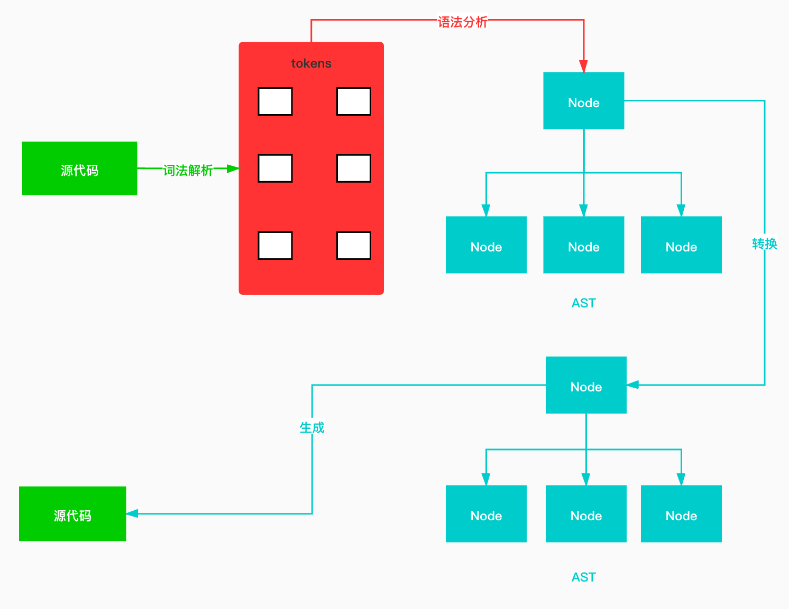
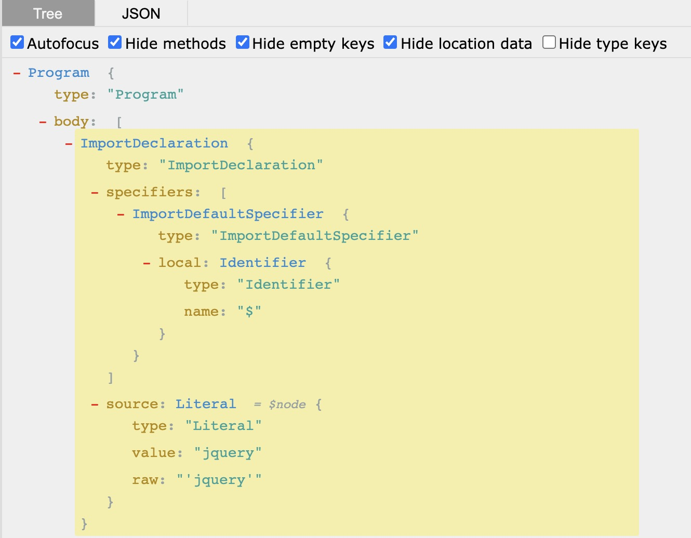
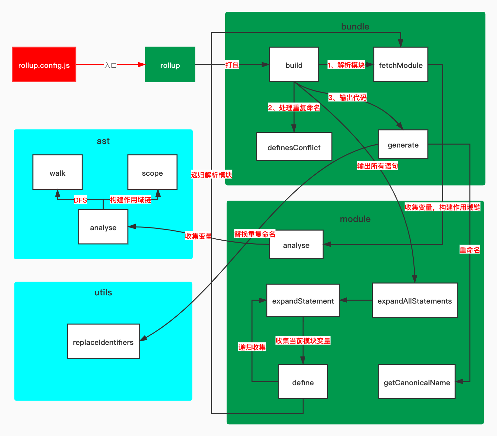

<!-- START doctoc generated TOC please keep comment here to allow auto update -->
<!-- DON'T EDIT THIS SECTION, INSTEAD RE-RUN doctoc TO UPDATE -->
**Table of Contents**  *generated with [DocToc](https://github.com/thlorenz/doctoc)*

- [揭秘 Rollup Tree Shaking](#%E6%8F%AD%E7%A7%98-rollup-tree-shaking)
  - [前言](#%E5%89%8D%E8%A8%80)
  - [对比webpack](#%E5%AF%B9%E6%AF%94webpack)
  - [如何使用rollup](#%E5%A6%82%E4%BD%95%E4%BD%BF%E7%94%A8rollup)
  - [使用tree shaking 功能](#%E4%BD%BF%E7%94%A8tree-shaking-%E5%8A%9F%E8%83%BD)
  - [rollup源码解析](#rollup%E6%BA%90%E7%A0%81%E8%A7%A3%E6%9E%90)
  - [magic-string](#magic-string)
  - [acorn](#acorn)
    - [AST工作流](#ast%E5%B7%A5%E4%BD%9C%E6%B5%81)
    - [AST解析过程](#ast%E8%A7%A3%E6%9E%90%E8%BF%87%E7%A8%8B)
    - [Scope](#scope)
  - [实现rollup](#%E5%AE%9E%E7%8E%B0rollup)
  - [实现 tree shaking](#%E5%AE%9E%E7%8E%B0-tree-shaking)
  - [依赖的变量有做修改操作](#%E4%BE%9D%E8%B5%96%E7%9A%84%E5%8F%98%E9%87%8F%E6%9C%89%E5%81%9A%E4%BF%AE%E6%94%B9%E6%93%8D%E4%BD%9C)
  - [支持块级作用域](#%E6%94%AF%E6%8C%81%E5%9D%97%E7%BA%A7%E4%BD%9C%E7%94%A8%E5%9F%9F)
  - [处理入口处 tree shaking](#%E5%A4%84%E7%90%86%E5%85%A5%E5%8F%A3%E5%A4%84-tree-shaking)
  - [实现变量重命名](#%E5%AE%9E%E7%8E%B0%E5%8F%98%E9%87%8F%E9%87%8D%E5%91%BD%E5%90%8D)
  - [总结](#%E6%80%BB%E7%BB%93)
  - [引用](#%E5%BC%95%E7%94%A8)

<!-- END doctoc generated TOC please keep comment here to allow auto update -->

# 揭秘 Rollup Tree Shaking 


> 文章首发于[@careteen/rollup](https://github.com/careteenL/rollup)，转载请注明来源即可。

## 前言

[rollup](https://rollupjs.org/guide/en/)随着[ES2015](https://en.wikipedia.org/wiki/ECMAScript#6th_Edition_%E2%80%93_ECMAScript_2015)发布[Scripts and Modules](https://tc39.es/ecma262/#sec-ecmascript-language-scripts-and-modules)横空出世。

`Next-generation ES module bundler`官网定义此为**下一代ES模块捆绑器**。

可以发现目前前端最火的几个框架[Angular](https://github.com/angular/angular/blob/master/package.json#L140)/[React](https://github.com/facebook/react/blob/master/package.json#L109)/[Vue](https://github.com/vuejs/vue/blob/dev/package.json#L17)都在使用`rollup`作为打包工具。

`rollup`依赖于`ES6的module`，提供`Tree-shaking`功能。对其直译为`树木摇晃`，即将树木上面枯死的树叶摇晃下来。对应到编程中则是去除掉无用代码。这对于大型项目能起到一定优化作用。

比如在做一些中后台时会使用到[ant-design]()部分组件，但是如果直接`import Ant from 'antd'`会将所有组件代码进行打包，而官方也提供了[babel-plugin-import](https://github.com/ant-design/babel-plugin-import)插件支持按需加载。从一定程度减小项目体积，使页面更快呈现给用户。

## 对比webpack

- `webpack`可以进行**代码分隔**,**静态资源处理**,**热模块替换**
- `rollup`支持`ES6 module`，`tree-shaking`功能强大；但`webpack`不支持导出`ES6 module`。
- `webpack`打包体积臃肿，`rollup`打包后简洁，更接近源代码。

对比两者各自特性，可以发现`webpack`更适合于`应用`，而`rollup`更适用于`类库`。

> 项目中都在使用`webpack`进行开发，抱着知其然并知其所以然的态度也学习并实现了一个简版[webpack](https://github.com/careteenL/webpack)，并且研究其[热更新原理](https://github.com/careteenL/webpack-hmr)。感兴趣的同学可以前往阅读。


## 如何使用rollup

> 下面示例代码存放在[rollup基础使用](https://github.com/careteenL/rollup/tree/master/example/basic)，可前往进行调试。

项目根目录新建文件`rollup.config.dev.js`做如下配置
```js
// rollup.config.dev.js
import babel from 'rollup-plugin-babel'
import resolve from '@rollup/plugin-node-resolve'
import commonjs from '@rollup/plugin-commonjs'
import typescript from '@rollup/plugin-typescript'
import { terser } from 'rollup-plugin-terser'
import postcss from 'rollup-plugin-postcss'
import serve from 'rollup-plugin-serve'

export default {
  input: './src/index.ts',
  output: {
    file: 'dist/index.js',
    format: 'es',
  },
  plugins: [
    babel({
      exclude: 'node_modules/**',
    }),
    resolve(),
    commonjs(),
    typescript(),
    terser(),
    postcss(),
    serve({
      open: true,
      port: 2333,
      contentBase: './dist',
    }),
  ],
}
```

- [rollup-plugin-babel](https://github.com/rollup/plugins/tree/master/packages/babel#readme)支持使用新语法，用babel进行编译输出。
- [@rollup/plugin-node-resolve](https://github.com/rollup/plugins/tree/master/packages/node-resolve/#readme)支持解析第三方模块，即`node_modules`目录下。
- [@rollup/plugin-commonjs](https://github.com/rollup/plugins/tree/master/packages/commonjs/#readme)支持`commonjs规范`。（因为默认只支持`ES6 module`）
- [@rollup/plugin-typescript](https://github.com/rollup/plugins/tree/master/packages/typescript/#readme)支持解析`typescript`
- [rollup-plugin-terser](https://github.com/TrySound/rollup-plugin-terser#readme)支持压缩`js`
- [rollup-plugin-postcss](https://github.com/egoist/rollup-plugin-postcss#readme)支持编译`css`
- [rollup-plugin-serve](https://github.com/thgh/rollup-plugin-serve)支持启动本地服务器


再新建`src/index.ts`文件
```ts
// src/index.ts
console.log('hello rollup')
```

在`package.json`文件中配置
```json
// package.json
"scripts": {
  "dev": "rollup --config rollup.config.dev.js -w",
},
```

运行脚本`npm run dev`

## 使用tree shaking 功能

新建文件`src/userinfo.ts`

```ts
// src/userinfo.ts
export const name = 'careteen'
export const age = 25

```
改动`src/index.ts`
```ts
// src/index.ts
import { name, age } from './userinfo'
console.log(name)
```
运行脚本`npm run dev`后查看`dist/index.js`
```js
const name = 'careteen'
console.log(name)
```
可发现，`rollup`将两个文件合并成一个文件输出，去除了无用代码`export const age = 25`，而且也去除了`import/export`语句。

## rollup源码解析

当下最新`rollup`功能丰富，架构复杂。而此文主要是想研究`tree-shaking`功能，故翻看`rollup`提交记录，找到[rollup@0.2.0](https://github.com/rollup/rollup/tree/53f98a40188215573e47ed95294bc5f631aeec28)最初可用版本。
文件数量和代码行数都比较少，也方便我们能读懂。

```shell
.
├── Bundle
│   └── index.js # 负责打包
├── Module
│   └── index.js # 负责解析模块
├── ast
│   ├── Scope.js # 作用域链
│   ├── analyse.js # 解析ast语法树
│   └── walk.js # 遍历ast语法树
├── finalisers # 输出类型
│   ├── amd.js
│   ├── cjs.js
│   ├── es6.js
│   ├── index.js
│   └── umd.js
├── rollup.js # 入口
└── utils # 工具函数
    ├── map-helpers.js
    ├── object.js
    ├── promise.js
    └── replaceIdentifiers.js
```

- `rollup.js`打包入口文件
- `Bundle/index.js`打包工具，打包时生成一个`Bundle`实例，收集依赖的所有模块，最后将代码打包在一起输出
- `Module/index.js`每个文件就是一个模块
- `ast/Scope.js`构建作用域和作用域链
- `ast/analyse.js`分析`Ast`作用域和依赖项
- `ast/walk.js`遍历`Ast`

简单浏览代码依赖的第三方库，可以看到[magic-string](https://github.com/rich-harris/magic-string#readme)和[acorn](https://github.com/acornjs/acorn#readme)，我们先做个简单了解。

## magic-string

作用是可以对源代码进行轻微的修改和替换。
```js
const MagicString = require('magic-string')

const s = new MagicString(`export var name = 'careteen'`)
// 返回剪切后的字符
console.log(s.snip(0, 6).toString(), s.toString()) // export, export var name = 'careteen'
// 移除指定位置区间字符
console.log(s.remove(0, 7).toString(), s.toString()) // var name = 'careteen', var name = 'careteen'

// 用指定分隔符拼接源代码
const b = new MagicString.Bundle()
b.addSource({
  content: `var name = 'careteen'`,
  separator: '\n',
})
b.addSource({
  content: `var age = 25`,
  separator: '\n',
})
console.log(b.toString()) // var name = 'careteen' \n var age = 25
```

## acorn

> 下面涉及代码存放在[@careteen/rollup - prepos](https://github.com/careteenL/rollup/tree/master/example/prepos)，感兴趣可前往调试。

`JavaScript`解析器，将源代码解析成抽象语法树`AST`。


树上定义了代码的结构，通过操作这棵树，可以精准的定位到**声明语句、赋值语句、运算语句**等等。实现对代码的**分析、优化、变更**等操作。

### AST工作流

- Parse(解析) 将源代码转换成抽象语法树，树上有很多的estree节点
- Transform(转换) 对抽象语法树进行转换
- Generate(代码生成) 将上一步经过转换过的抽象语法树生成新的代码



### AST解析过程

借助[astexplorer](https://astexplorer.net/)可以实时预览源代码的解析结果。并且设置`Parser Settings`为`acorn`。

下面代码解析结果如图
```js
import $ from 'jquery';
```


那如何去遍历抽象语法树，并在合适的时机操作它呢？

采用`深度优先遍历`。

> 还不了解的同学前往[图解深度优先遍历算法](https://github.com/careteenL/data-structure_algorithm/blob/0816-leetcode/src/algorithm/recursion/dfs-bfs.md)
```js
// walk.js
// DFS
function walk (node, { enter, leave }) {
  visit(node, null, enter, leave)
}

function visit (node, parent, enter, leave) {
  if (enter) {
    enter.call(null, node, parent)
  }
  const keys = Object.keys(node).filter(key => typeof node[key] === 'object')
  keys.forEach(key => {
    const value = node[key]
    if (Array.isArray(value)) {
      value.forEach(val => {
        visit(val, node, enter, leave)
      })
    } else if (value && value.type) {
      visit(value, node, enter, leave)
    }
  })
  if (leave) {
    leave.call(null, node, parent)
  }
}

module.exports = walk
```
> 此逻辑在源码[rollup/ast/walk.js](https://github.com/rollup/rollup/blob/53f98a40188215573e47ed95294bc5f631aeec28/src/ast/walk.js)处

输出抽象语法树

```js
// ast.js
const walk = require('./walk')
const acorn = require('acorn')

const ast = acorn.parse(
  `import $ from 'jquery';`,
  {
    locations: true,
    ranges: true,
    sourceType: 'module',
    ecmaVersion: 8,
  }
)

let ident = 0
const padding = () => ' '.repeat(ident)

// Test
ast.body.forEach(statement => {
  walk(statement, {
    enter(node) {
      if (node.type) {
        console.log(padding() + node.type)
        ident += 2
      }
    },
    leave(node) {
      if (node.type) {
        ident -= 2
        console.log(padding() + node.type)
      }
    }
  })
})

// 输出结果
/**
ImportDeclaration
  ImportDefaultSpecifier
    Identifier
    Identifier
  ImportDefaultSpecifier
  Literal
  Literal
ImportDeclaration
 */
```
期望的输出结果和上图结构一样。

### Scope

> 源码处还有此文件[rollup/ast/Scope.js](https://github.com/rollup/rollup/blob/53f98a40188215573e47ed95294bc5f631aeec28/src/ast/Scope.js)相对独立，其实为创建作用域的简易实现。

```js
// scope.js
class Scope {
  constructor(options = {}) {
    this.name = options.name
    this.parent = options.parent
    this.names = options.params || []
  }
  add(name) {
    this.names.push(name)
  }
  findDefiningScope(name) {
    if (this.names.includes(name)) {
      return this
    }
    if (this.parent) {
      return this.parent.findDefiningScope(name)
    }
    return null
  }
}

module.exports = Scope
```
> 此逻辑在源码[rollup/ast/scope.js](https://github.com/rollup/rollup/blob/53f98a40188215573e47ed95294bc5f631aeec28/src/ast/scope.js)处

看看如何使用
```js
// useScope.js
const Scope = require('./scope')

var a = 1
function one() {
  var b = 2
  function two() {
    var c = 3
    console.log(a, b, c)
  }
  two()
}
one()

// 构建scope chain
const globalScope = new Scope({
  name: 'global',
  parent: null,
})
const oneScope = new Scope({
  name: 'one',
  parent: globalScope,
})
const twoScope = new Scope({
  name: 'two',
  parent: oneScope,
})

globalScope.add('a')
oneScope.add('b')
twoScope.add('c')

console.log(twoScope.findDefiningScope('a'))
console.log(oneScope.findDefiningScope('c'))
console.log(globalScope.findDefiningScope('d'))

// 输出结果
// 1 2 3
// Scope { name: 'global', parent: null, names: [ 'a' ] }
// null
// null
```
此文件主要作用是创建作用域和作用域链，并且将声明的变量挂载到对应的作用域，而且也提供方法`findDefiningScope`查找具体变量所在的作用域。

其意义重大，`rollup`可以借助他判断变量是否为当前文件定义，否则为`import`导入，进而递归直到找到变量定义所在作用域，然后将依赖写入。

`ES module`特性是`export`的是值的引用，在`import`后如果对其修改会改变源，即只是个浅拷贝。

找到变量所在作用域后，可直接将其源代码剪切过来输出。（后面有详细实现）


## 实现rollup




新建可调式的配置文件，将`src/index.js`作为入口文件，打包后输出到`dest/bundle.js`
```js
// ./example/myRollup/rollup.config.js
const path = require('path')
const rollup = require('../../src/rollup')

const entry = path.resolve(__dirname, 'src/index.js')
rollup(entry, 'dest/bundle.js')
```

入口文件则依赖于`bundle`对其真正编译打包。
```js
// .src/rollup.js
const Bundle = require('./bundle')

function rollup(entry, filename) {
  const bundle = new Bundle({
    entry,
  })
  bundle.build(filename)
}

module.exports = rollup
```

初步思路则是解析入口文件`entryPath`内容，对源代码做解析处理，并输出到目标文件下。
```js
// .src/bundle.js
const path = require('path')

class Bundle {
  constructor(options) {
    this.entryPath = path.resolve(options.entry.replace(/\.js$/, '') + '.js')
    this.modules = {}
  }
  build(filename) {
    console.log(this.entryPath, filename)
  }
}

module.exports = Bundle
```

大致流程为

- 1. 获取入口文件的内容，包装成`module`，生成抽象语法树
- 2. 对入口文件抽象语法树进行依赖解析
- 3. 生成最终代码
- 4. 写入目标文件
```js
// .src/bundle.js
const { readFileSync, writeFileSync } = require('fs')
const { resolve } = require('path')
const Module = require('./module')
const MagicString = require('magic-string')

class Bundle {
  constructor(options) {
    this.entryPath = resolve(options.entry.replace(/\.js$/, '') + '.js')
    this.modules = {}
    this.statements = []
  }
  build(filename) {
    // 1. 获取入口文件的内容，包装成`module`，生成抽象语法树
    const entryModule = this.fetchModule(this.entryPath)
    // 2. 对入口文件抽象语法树进行依赖解析
    this.statements = entryModule.expandAllStatements()
    // 3. 生成最终代码
    const { code } = this.generate()
    // 4. 写入目标文件
    writeFileSync(filename, code)
  }
  fetchModule(importee) {
    let route = importee
    if (route) {
      const code = readFileSync(route, 'utf-8')
      const module = new Module({
        code,
        path: importee,
        bundle: this,
      })
      return module
    }
  }
  generate() {
    const ms = new MagicString.Bundle()
    this.statements.forEach(statement => {
      const source = statement._source.clone()
      ms.addSource({
        content: source,
        separator: '\n',
      })
    })
    return {
      code: ms.toString()
    }
  }
}

module.exports = Bundle
```

每一个文件即是一个`module`，会将源代码解析成抽象语法树，然后将源代码挂载到树的节点上，并提供展开修改方法。
```js
// ./src/module.js
const { parse } = require('acorn')
const MagicString = require('magic-string')
const analyse = require('./ast/analyse')

class Module {
  constructor({
    code,
    path,
    bundle,
  }) {
    this.code = new MagicString(code, {
      filename: path,
    })
    this.path = path
    this.bundle = bundle
    this.ast = parse(code, {
      ecmaVersion: 7,
      sourceType: 'module',
    })
    this.analyse()
  }
  analyse() {
    analyse(this.ast, this.code, this)
  }
  expandAllStatements() {
    const allStatements = []
    this.ast.body.forEach(statement => {
      const statements = this.expandStatement(statement)
      allStatements.push(...statements)
    })
    return allStatements
  }
  expandStatement(statement) {
    statement._included = true
    const result = []
    result.push(statement)
    return result
  }
}

module.exports = Module
```

将源代码挂载到树的节点上。
```js
// ./src/ast/analyse.js
function analyse(ast, ms) {
  ast.body.forEach(statement => {
    Object.defineProperties(statement, {
      _source: {
        value: ms.snip(statement.start, statement.end)
      }
    })
  })
}

module.exports = analyse
```

## 实现 tree shaking


将调试文件内容做如下修改，测试tree-shaking功能
```js
// ./example/myRollup/src/index.js
import { name, age } from './userinfo'

function say() {
  console.log('hi ', name)
}

say()
```
依赖的userinfo文件
```js
// ./example/myRollup/src/userinfo.js
export var name = 'careteen'
export var age = 25
```

期望打包结果为
```js
var name = 'careteen'
function say() {
  console.log('hi ', name)
}

say()
```

需要做如下`// +`处新增和修改
```js
// ./src/bundle.js
const { readFileSync, writeFileSync } = require('fs')
const { resolve, isAbsolute, dirname } = require('path') // +
const Module = require('./module')
const MagicString = require('magic-string')

class Bundle {
  constructor(options) {
    this.entryPath = resolve(options.entry.replace(/\.js$/, '') + '.js')
    this.modules = {}
    this.statements = []
  }
  build(filename) {
    const entryModule = this.fetchModule(this.entryPath)
    this.statements = entryModule.expandAllStatements()
    const { code } = this.generate()
    writeFileSync(filename, code)
  }
  fetchModule(importee, importer) { // +
    let route // +
    if (!importer) { // +
      route = importee // +
    } else { // +
      if (isAbsolute(importee)) { // +
        route = importee // +
      } else if (importee[0] === '.') { // +
        route = resolve(dirname(importer), importee.replace(/\.js$/, '') + '.js') // +
      } // +
    } // +
    if (route) {
      const code = readFileSync(route, 'utf-8')
      const module = new Module({
        code,
        path: importee,
        bundle: this,
      })
      return module
    }
  }
  generate() {
    const ms = new MagicString.Bundle()
    this.statements.forEach(statement => {
      const source = statement._source.clone()
      if (/^Export/.test(statement.type)) { // +
        if (statement.type === 'ExportNamedDeclaration') { // +
          source.remove(statement.start, statement.declaration.start) // +
        } // +
      } // +
      ms.addSource({
        content: source,
        separator: '\n',
      })
    })
    return {
      code: ms.toString()
    }
  }
}

module.exports = Bundle
```

主要是修改`fetchModule`方法，处理类似于`import { name } from './userinfo'`的情况时，`userinfo`中若有定义变量或者依赖其他文件变量时，做递归处理。

生成代码时`generate`方法中过滤掉`ExportNamedDeclaration`语句，而将变量定义直接输出。
```diff
- export var name = 'careteen'
+ var name = 'careteen'
```

对module模块做处理
```js
// ./src/module.js
const { parse } = require('acorn')
const MagicString = require('magic-string')
const analyse = require('./ast/analyse')

function hasOwn(obj, prop) { // +
  return Object.prototype.hasOwnProperty.call(obj, prop) // +
} // +

class Module {
  constructor({
    code,
    path,
    bundle,
  }) {
    this.code = new MagicString(code, {
      filename: path,
    })
    this.path = path
    this.bundle = bundle
    this.ast = parse(code, {
      ecmaVersion: 7,
      sourceType: 'module',
    })
    // +++ start +++
    this.imports = {} // 导入的变量
    this.exports = {} // 导出的变量
    this.definitions = {} // 变量定义的语句
    // +++ end +++
    this.analyse()
  }
  analyse() {
    // +++ start +++
    // 收集导入和导出变量
    this.ast.body.forEach(node => {
      if (node.type === 'ImportDeclaration') {
        const source = node.source.value
        node.specifiers.forEach(specifier => {
          const { name: localName} = specifier.local
          const { name } = specifier.imported
          this.imports[localName] = {
            source,
            name,
            localName,
          }
        })
      } else if (node.type === 'ExportNamedDeclaration') {
        const { declaration } = node
        if (declaration.type === 'VariableDeclaration') {
          const { name } = declaration.declarations[0].id
          this.exports[name] = {
            node,
            localName: name,
            expression: declaration,
          }
        }
      }
    })
    // +++ end +++
    analyse(this.ast, this.code, this)
    // +++ start +++
    // 收集所有语句定义的变量，建立变量和声明语句之间的对应关系
    this.ast.body.forEach(statement => {
      Object.keys(statement._defines).forEach(name => {
        this.definitions[name] = statement
      })
    })
    // +++ end +++
  }
  expandAllStatements() {
    const allStatements = []
    this.ast.body.forEach(statement => {
      // +++ start +++
      // 过滤`import`语句
      if (statement.type === 'ImportDeclaration') {
        return
      }
      // +++ end +++
      const statements = this.expandStatement(statement)
      allStatements.push(...statements)
    })
    return allStatements
  }
  expandStatement(statement) {
    statement._included = true
    const result = []
    // +++ start +++
    const dependencies = Object.keys(statement._dependsOn)
    dependencies.forEach(name => {
      const definition = this.define(name)
      result.push(...definition)
    })
    // +++ end +++
    result.push(statement)
    return result
  }
  // +++ start +++
  define(name) {
    if (hasOwn(this.imports, name)) {
      const importDeclaration = this.imports[name]
      const mod = this.bundle.fetchModule(importDeclaration.source, this.path)
      const exportDeclaration = mod.exports[importDeclaration.name]
      if (!exportDeclaration) {
        throw new Error(`Module ${mod.path} does not export ${importDeclaration.name} (imported by ${this.path})`)
      }
      return mod.define(exportDeclaration.localName)
    } else {
      let statement = this.definitions[name]
      if (statement && !statement._included) {
        return this.expandStatement(statement)
      } else {
        return []
      }
    }
  }
  // +++ end +++
}

module.exports = Module
```

需要做几件事

- 收集导入和导出变量
  - 建立映射关系，方便后续使用
- 收集所有语句定义的变量
  - 建立变量和声明语句之间的对应关系，方便后续使用
- 过滤`import`语句
  - 删除关键词
- 输出语句时，判断变量是否为`import`
  - 如是需要递归再次收集依赖文件的变量
  - 否则直接输出

- 构建依赖关系，创建作用域链，交由`./src/ast/analyse.js`文件处理
  - 在抽象语法树的每一条语句上挂载`_source(源代码)、_defines(当前模块定义的变量)、_dependsOn(外部依赖的变量)、_included(是否已经包含在输出语句中)`
  - 收集每个语句上定义的变量，创建作用域链
  - 收集外部依赖的变量

```js
// ./src/ast/analyse.js
// +++ start +++
const Scope = require('./scope')
const walk = require('./walk')

function analyse(ast, ms) {
  let scope = new Scope()
  // 创建作用域链、
  ast.body.forEach(statement => {
    function addToScope(declarator) {
      const { name } = declarator.id
      scope.add(name)
      if (!scope.parent) { // 如果没有上层作用域，说明是模块内的定级作用域
        statement._defines[name] = true
      }
    }
    Object.defineProperties(statement, {
      _source: { // 源代码
        value: ms.snip(statement.start, statement.end),
      },
      _defines: { // 当前模块定义的变量
        value: {},
      },
      _dependsOn: { // 当前模块没有定义的变量，即外部依赖的变量
        value: {},
      },
      _included: { // 是否已经包含在输出语句中
        value: false,
        writable: true,
      },
    })
    // 收集每个语句上定义的变量，创建作用域链
    walk(statement, {
      enter(node) {
        let newScope
        switch (node.type) {
          case 'FunctionDeclaration':
            const params = node.params.map(p => p.name)
            addToScope(node)
            newScope = new Scope({
              parent: scope,
              params,
            })
            break;
          case 'VariableDeclaration':
            node.declarations.forEach(addToScope)
            break;
        }
        if (newScope) {
          Object.defineProperty(node, '_scope', {
            value: newScope,
          })
          scope = newScope
        }
      },
      leave(node) {
        if (node._scope) {
          scope = scope.parent
        }
      },
    })
  })
  ast._scope = scope
  // 收集外部依赖的变量
  ast.body.forEach(statement => {
    walk(statement, {
      enter(node) {
        if (node.type === 'Identifier') {
          const { name } = node
          const definingScope = scope.findDefiningScope(name)
          // 作用域链中找不到 则说明为外部依赖
          if (!definingScope) {
            statement._dependsOn[name] = true
          }
        }
      },
    })
  })
}

module.exports = analyse
// +++ end +++
```

依赖的遍历和作用域可直接使用上文提到的[walk](#AST解析过程)和[Scope](#Scope)的实现。

## 依赖的变量有做修改操作

经过上述处理，已经基本实现简易`tree-shaking`功能，但是对于如下**依赖文件中导出变量有做过修改**还需处理
```js
// ./example/myRollup/src/userinfo.js
export var name = 'careteen'
name += 'lan'
name ++
export var age = 25
```

需要在`./src/module.js`文件下做如下`// +`的新增修改
```js
// ./src/module.js
class Module {
  constructor() {
    // ...
    this.definitions = {} // 变量定义的语句
    this.modifications = {} // 修改的变量 // +
    this.analyse()    
  }
  analyse() {
    // ...
    // 收集所有语句定义的变量，建立变量和声明语句之间的对应关系
    this.ast.body.forEach(statement => {
      Object.keys(statement._defines).forEach(name => {
        this.definitions[name] = statement
      })
      // +++ start +++
      Object.keys(statement._modifies).forEach(name => {
        if (!hasOwn(this.modifications, name)) {
          this.modifications[name] = []
        }
        // 可能有多处修改
        this.modifications[name].push(statement)
      })
      // +++ end +++
    })    
  }
  expandStatement(statement) {
    statement._included = true
    const result = []
    const dependencies = Object.keys(statement._dependsOn)
    dependencies.forEach(name => {
      const definition = this.define(name)
      result.push(...definition)
    })
    result.push(statement)
    // +++ start +++
    // 当前模块下所定义的变量 若有修改 则加入result
    const defines = Object.keys(statement._defines)
    defines.forEach(name => {
      const modifications = hasOwn(this.modifications, name) && this.modifications[name]
      if (modifications) {
        modifications.forEach(modif => {
          if (!modif._included) {
            const statements = this.expandStatement(modif)
            result.push(...statements)
          }
        })
      }
    })
    // +++ end +++
    return result
  }  
}
```

需要做几件事

- 在抽象语法树每条语句中定义修改的变量`_modifies` (交由`src/ast/analyse.js`处理)
  - 收集外部依赖的变量(上面已经实现过)
  - 收集变量修改的语句
- 将所有修改语句的变量存放到`modifications`
- 输出语句时，判断定义的变量`_defines`中是否含有修改语句变量，若有则需要输出

```js
// ./src/ast/analyse.js
function analyse(ast, ms) {
  ast.body.forEach(statement => {
    // ...
    Object.defineProperties(statement, {
      // ...
      _modifies: { // 修改的变量
        value: {}, // +
      },
    })    
  })
  ast.body.forEach(statement => {
    // +++ start +++
    // 收集外部依赖的变量
    function checkForReads(node) {
      if (node.type === 'Identifier') {
        const { name } = node
        const definingScope = scope.findDefiningScope(name)
        // 作用域链中找不到 则说明为外部依赖
        if (!definingScope) {
          statement._dependsOn[name] = true
        }
      }
    }
    // 收集变量修改的语句
    function checkForWrites(node) {
      function addNode(n) {
        while (n.type === 'MemberExpression') { // var a = 1; var obj = { c: 3 }; a += obj.c;
          n = n.object
        }
        if (n.type !== 'Identifier') {
          return
        }
        statement._modifies[n.name] = true
      }
      if (node.type === 'AssignmentExpression') {
        addNode(node.left)
      } else if (node.type === 'UpdateExpression') { // var a = 1; a++
        addNode(node.argument)
      } else if (node.type === 'CallExpression') {
        node.arguments.forEach(addNode)
      }
    }
    // // +++ end +++
    walk(statement, {
      enter(node) {
        // +++ start +++
        if (node._scope) {
          scope = node._scope
        }
        checkForReads(node)
        checkForWrites(node)
      },
      leave(node) {
        if (node._scope) {
          scope = scope.parent
        }
      }
      // +++ end +++
    })
  })  
}
```

经过上述处理后，可得到期望的输出结果
```js
// ./example/myRollup/dest/bundle.js
var name = 'careteen'
name += 'lan'
name ++
function say() {
  console.log('hi ', name)
}
say()
```

## 支持块级作用域

对于如下语句，还需提供支持
```js
if(true) {
  var blockVariable = 25
}
console.log(blockVariable)
```

需要做如下处理
```js
// ./src/ast/scope.js
class Scope {
  constructor(options = {}) {
    // ...
    this.isBlockScope = !!options.block // 是否为块作用域
  }
  // +++ start +++
  add(name, isBlockDeclaration) {
    if (this.isBlockScope && !isBlockDeclaration) { // 当前作用域是块级作用域 && 此语句为var或申明函数
      this.parent.add(name, isBlockDeclaration)
    } else {
      this.names.push(name)
    }
  }
  // +++ end +++
}

```

- 创建作用域时，区分块级作用域和普通变量定义

```js
// ./src/ast/analyse.js
function analyse(ast, ms) {
  ast.body.forEach(statement => {
    function addToScope(declarator, isBlockDeclaration = false) { // +
      const { name } = declarator.id
      scope.add(name, isBlockDeclaration) // +
      // ...
    }
    // ...
    // 收集每个语句上定义的变量，创建作用域链
    walk(statement, {
      enter(node) {
        let newScope
        switch (node.type) {
          // +++ start +++
          case 'FunctionExpression':
          case 'FunctionDeclaration':
            const params = node.params.map(p => p.name)
            if (node.type === 'FunctionDeclaration') {
              addToScope(node)
            } else if (node.type === 'FunctionExpression' && node.id) {
              params.push(node.id.name)
            }
            newScope = new Scope({
              parent: scope,
              params,
              block: true,
            })
            break;
          case 'BlockStatement':
            newScope = new Scope({
              parent: scope,
              block: true,
            })
            break;
          case 'VariableDeclaration':
            node.declarations.forEach(variableDeclarator => {
              if (node.kind === 'let' || node.kind === 'const') {
                addToScope(variableDeclarator, true)
              } else {
                addToScope(variableDeclarator, false)
              }
            })
            break;
          // +++ end +++
        }
      }
    } 
  }
}
```

输出语句时将系统变量`console.log`做处理，避免输出两次。
```js
// ./src/module.js
const SYSTEM_VARIABLE = ['console', 'log']
class Module {
  // ...
  define(name) {
    if (hasOwn(this.imports, name)) {
      // ...
    } else {
      let statement = this.definitions[name]
      // +++ start +++
      if (statement && !statement._included) {
        return this.expandStatement(statement)
      } else if (SYSTEM_VARIABLE.includes(name)) {
        return []
      } else {
        throw new Error(`variable '${name}' is not exist`)
      }
      // +++ end +++
    }
  }  
}
```

## 处理入口处 tree shaking

上述tree-shaking是针对于有`import`语句时的处理，对于入口文件有定义但未使用变量时，还需处理
```js
var company = 'sohu focus'
var companyAge = 23
console.log(company)
```

- 过滤定义但未使用的变量
- 收集定义变量时，如果变量已经输出则不再输出

```js
// ./src/module.js
class Module {
  // ...
  expandAllStatements() {
    if (statement.type === 'ImportDeclaration') {
      return
    }
    // +++ start +++
    // 过滤定义但未使用的变量
    if (statement.type === 'VariableDeclaration') {
      return
    }
    // +++ end +++
  }
  define(name) {
    if (hasOwn(this.imports, name)) {
    // ...
    } else {
      let statement = this.definitions[name]
      // +++ start +++
      if (statement) {
        if (statement._included) {
          return []
        } else {
          return this.expandStatement(statement)
        }
        // +++ end +++
      } else if (SYSTEM_VARIABLE.includes(name)) {
        return []
      } else {
        throw new Error(`variable '${name}' is not exist`)
      }
    }
  }  
}
```

## 实现变量重命名

存在如下情况，多个模块都有某个变量相同命名`company`

```js
// ./example/myRollup/src/compay1.ts
const company = 'qunar'
export const company1 = company + '1'

// ./example/myRollup/src/compay2.ts
const company = 'sohu'
export const company2 = company + '2'
```

```js
// ./example/myRollup/src/index.ts
import { company1 } from './compay1'
import { company2 } from './compay2'
console.log(company1, company2)
```

此时需要在打包时对重名变量适当重命名再输出

先抽离和准备工具函数

```js
// ./src/utils.js
const walk = require('./ast/walk')

function hasOwn(obj, prop) {
  return Object.prototype.hasOwnProperty.call(obj, prop)
}

function replaceIdentifiers(statement, source, replacements) {
  walk(statement, {
    enter(node) {
      if (node.type === 'Identifier') {
        if (node.name && replacements[node.name]) {
          source.overwrite(node.start, node.end, replacements[node.name])
        }
      }
    }
  })
}

module.exports = {
  hasOwn,
  replaceIdentifiers,
}
```

在抽象语法树每条语句上挂载当前模块的实例
```js
// ./src/ast/analyse.js
function analyse(ast, ms, module) { // +
  ast.body.forEach(statement => {
    Object.defineProperties(statement, {
      _module: { // module实例
        value: module, // +
      },
      // ...
    }
  }
}
```
在module上提供重命名的方法
```js
// ./src/module.js
class Module {
  constructor() {
    // ...
    this.canonicalNames = {} // 不重名的变量
    this.analyse()
  }
  // +++ start ++
  rename(name, replacement) {
    this.canonicalNames[name] = replacement
  }
  getCanonicalName(localName) {
    if (!hasOwn(this.canonicalNames, localName)) {
      this.canonicalNames[localName] = localName
    }
    return this.canonicalNames[localName]
  }
  // +++ end ++
}
```
- 收集重复命名的变量
- 重命名重复命名的变量
```js
// ./src/bundle.js
const { hasOwn, replaceIdentifiers } = require('./utils')

class Bundle {
  constructor(options) {
  build(filename) {
    const entryModule = this.fetchModule(this.entryPath)
    this.statements = entryModule.expandAllStatements()
    this.definesConflict() // +
    const { code } = this.generate()
    writeFileSync(filename, code)
  }
  // +++ start +++
  definesConflict() {
    const defines = {}
    const conflicts = {}
    this.statements.forEach(statement => {
      Object.keys(statement._defines).forEach(name => {
        if (hasOwn(defines, name)) {
          conflicts[name] = true
        } else {
          defines[name] = []
        }
        defines[name].push(statement._module)
      })
    })
    Object.keys(conflicts).forEach(name => {
      const modules = defines[name]
      modules.pop() // 最后一个重名的不处理
      modules.forEach(module => {
        const replacement = getSafeName(name)
        module.rename(name,replacement)
      })
    })
    function getSafeName(name) {
      while (hasOwn(conflicts, name)) {
        name = `_${name}`
      }
      conflicts[name] = true
      return name
    }
  }
  // +++ end +++
  generate() {
    const ms = new MagicString.Bundle()
    this.statements.forEach(statement => {
      // +++ start +++
      let replacements = {}
      Object.keys(statement._dependsOn)
        .concat(Object.keys(statement._defines))
        .forEach(name => {
          const canonicalName = statement._module.getCanonicalName(name)
          if (name !== canonicalName) {
            replacements[name] = canonicalName
          }
        })
      // +++ end +++
      const source = statement._source.clone()
      if (/^Export/.test(statement.type)) {
        if (statement.type === 'ExportNamedDeclaration') {
          source.remove(statement.start, statement.declaration.start)
        }
      }
      replaceIdentifiers(statement, source, replacements) // +
    }
  }
}
```

进过上述处理，可得到如下输出结果

```js
// ./example/myRollup/dest/bundle.js
const _company = 'qunar'
const company1 = _company + '1'
const company = 'sohu'
const company2 = company + '2'
console.log(company1, company2)
```

✌🏻 😁 ✌🏻


## 总结

本文从`rollup`使用再到源码揭秘，实现了`Tree-shaking`简易功能，所有代码存放在[@careteen/rollup](https://github.com/careteenL/rollup)中。感兴趣的同学可以前往调试。


## 引用

- [Rollup 官网](https://rollupjs.org/guide/en/)
- [ECMA Module](https://tc39.es/ecma262/#sec-ecmascript-language-scripts-and-modules)
- [ES module 工作原理](https://hacks.mozilla.org/2018/03/es-modules-a-cartoon-deep-dive/)
- [webpack简易实现](https://github.com/careteenL/webpack)
- [commonjs规范原理](https://github.com/careteenL/blog/blob/master/src/20181201-node/module.md)
- [在线解析AST](https://astexplorer.net/)
